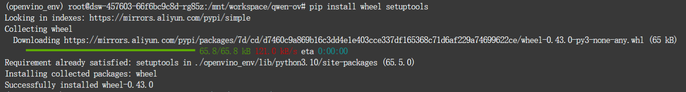

# LLM实验：大模型部署

#### **本实验基于大连理工大学软件学院胡燕教授的操作系统课程**

实验准备：
选择一个合适的基于Linux的部署平台，比如使用VMWare虚拟机配置的ubuntu或者云服务器

注：本次实验使用的是魔搭平台的云服务器

## 1. qwen1.5-0.5b模型部署

### 1.1 模型简介

模型简介请访问魔搭社区：

https://www.modelscope.cn/models/qwen/Qwen1.5-0.5B-Chat-GGUF/summary

### 1.2下载llama.cpp

#### （1）使用git命令克隆llama.cpp项目

    git clone https://github.com/ggerganov/llama.cpp

#### （2）编译llama.cpp

    cd llama.cpp
    make -j

### 1.3 加载模型并执行

在llama.cpp目录中执行命令

    ./main -m /path/to/local/dir/qwen/Qwen1.5-0.5B-Chat-GGUF/qwen1_5-0_5b-chat-q5_k_m.gguf -n 512 --color -i -cml
**上述命令中的"/path/to/local/dir"在执⾏时需要替换为实际的本地⽬录**。

若是使用魔搭平台，则应为：

    ./main-m/mnt/workspace/llama.cpp/qwen/Qwen1.5-0.5B-Chat-GGUF/qwen1_5-0_5b-chat-q5_k_m.gguf -n 512 --color -i-cml

### 1.4 模型测试

最后执行结束后，我们就可以与qwen大模型进行对话了！

## 2.基于OpenVINO的模型量化实践

### 2.1 安装基本环境

#### （1） 创建目录qwen-ov

    mkdir qwen-ov
    cd qwen-ov

#### （2）克隆qwen-ov模型:

    git clone https://github.com/OpenVINO-dev-contest/Qwen2.openvino

#### （3）创建python虚拟环境：

    python3 -m venv openvino_env
    source openvino_env/bin/activate

#### （4）升级pip：

    python3 -m pip install --upgrade pip

#### （5）安装依赖的包（等待时间较长）：

    pip install wheel setuptools

    pip install -r requirements.txt

**如果安装依赖时出现以下问题：**

**解决方案1：**

    pip install nncf==2.8.1 optimum-intel>=1.16.0 transformers>=4.38.2 openvino>=2024.0.0 onnx>=1.15.0 huggingface-hub>=0.21.3

**解决方案2：**

##### （1）先进入到requirements.txt所在的目录

    cd Qwen2.openvino

##### （2）然后再安装相关依赖

    pip install -r requirements.txt

### 2.2 下载模型

    export HF_ENDPOINT=https://hf-mirror.com

    huggingface-cli download --resume-download --local-dir-use-symlinks False Qwen/Qwen1.5-0.5B-Chat --local-dir {your_path}/Qwen1.5-0.5B-Chat

### 2.3 转换模型

    python3 convert.py --model_id Qwen/Qwen1.5-0.5B-Chat --precision int4 --output {your_path}/Qwen1.5-0.5B-Chat-ov

### 2.4 加载模型并执行

    python3 chat.py --model_path {your_path}/Qwen1.5-0.5B-Chat-ov --max_sequence_length 4096 --device CPU

## 3.智谱 ChatGLM3-6B 模型部署

### 3.1安装基本环境

### （1）克隆相关库

    git clone https://github.com/THUDM/ChatGLM3

#### (2) 创建一个新的 Anaconda 环境

    conda create -n chatglm3 python=3.8 

创建成功后激活相关环境:

    conda activate chatglm3

#### (3) 进入克隆的项目文件

    cd ChatGLM3

#### (4) 安装相关依赖

    pip install -r requirements.txt

#### (5) 下载ChatGLM3-6b 模型

    git lfs install
    git clone https://www.modelscope.cn/ZhipuAI/chatglm3-6b.git

#### (6) 修改cli_demo.py中的路径

先进入basic_demo

    cd basic_demo

修改cli_demo.py中的路径为自己的实际路径

    vim cli_demo.py

修改后：

### 3.2 模型运行

    python cli_demo.py

这样ChatGLM3-6b模型就部署完成了